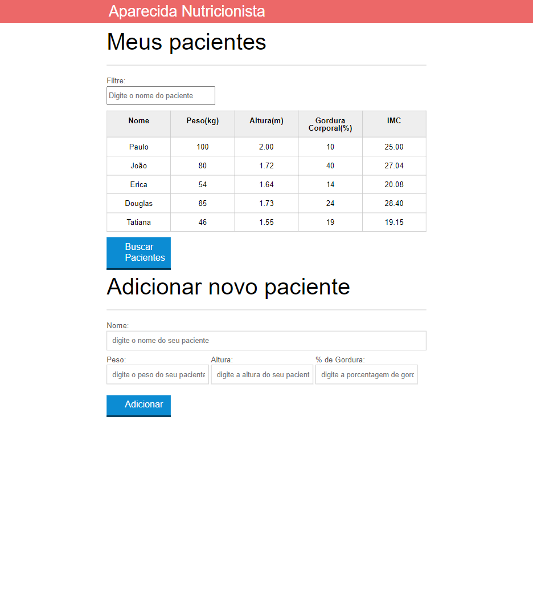

<h1 align="center"> Nutricionista </h1>

  <a href="#-tecnologias">Tecnologias</a>&nbsp;&nbsp;&nbsp;|&nbsp;&nbsp;&nbsp;
  <a href="#-projeto">Projeto</a>&nbsp;&nbsp;&nbsp;|&nbsp;&nbsp;&nbsp;
  <a href="#-contato">Contato</a>&nbsp;&nbsp;&nbsp;|&nbsp;&nbsp;&nbsp;
  <a href="#memo-licença">Licença</a>

  

 

  

## 🚀 Tecnologias

Esse projeto foi desenvolvido com as seguintes tecnologias:

- HTML e CSS
- JavaScript 
- Git e Github

## 💻 Projeto

O projeto mostra um sitema de clientes da nutricionista.

## 📲 Contato
> Email : pedrodiasnovais@hotmail.com
> linkedin : https://www.linkedin.com/in/pedronovaisoficial

## :memo: Licença

Esse projeto está sob a licença MIT.

---

